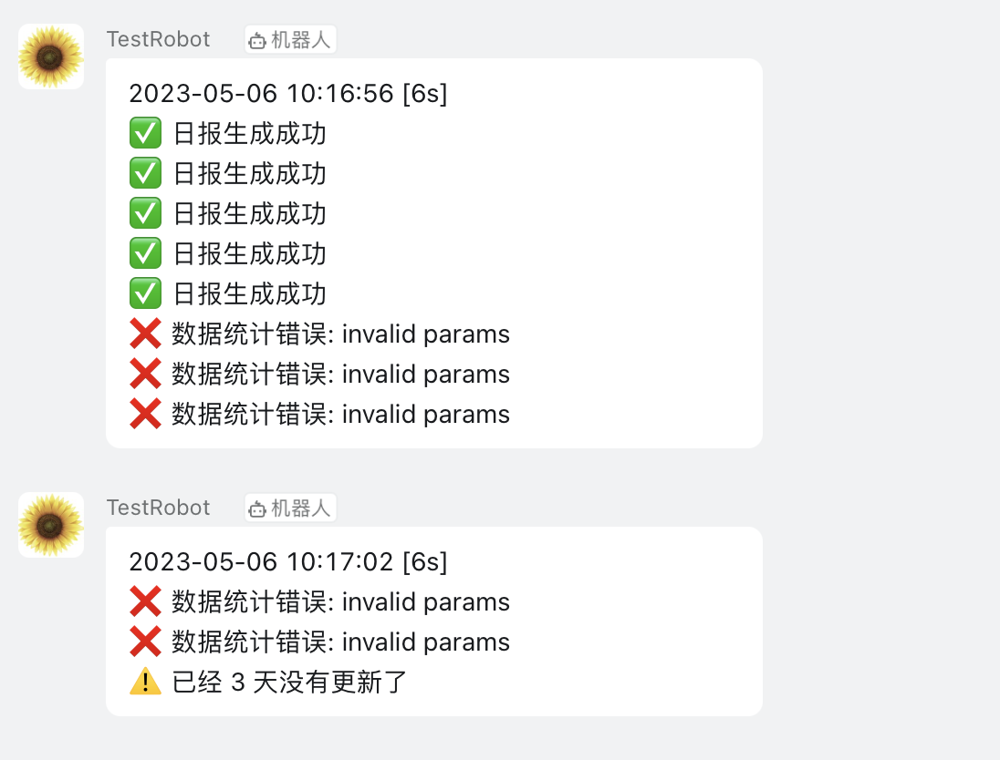

# Notifier

[](https://goreportcard.com/report/github.com/gozelle/notifier)
[](https://opensource.org/licenses/MIT)

一个简洁的、遵循日志打印习惯的消息通知库。

## 特性

* 简单的使用体验；
* 美观，Infof、Warnf、Errorf 对应各自的 icon，一目了然；
* 自动处理消息的分批发送，以应对 API 的限流；
* 驱动抽象设计，已对接钉钉；


## 安装

```go
go get github.com/gozelle/notifier 
```

## 快速上手

```go
package main

func main {
	robot := dingrobot.NewRobot(
		"https://oapi.dingtalk.com/robot/send?access_token=c8487958cbb991620877cbbe645e3ddd5c82cf0ab99681a8f70fae6c5e63d217",
		"SECa9d4d94de78b8b9afe45548dc25559c1a2ae00628a0b3ae372b05d9506c8af9e",
	)
	notify := notifier.NewNotify(robot)
	
	go func() {
		notify.Run()
	}()
	
	notify.Infof("日报生成成功")
	notify.Errorf("数据统计错误: %s", errors.New("invalid params"))
	
	select {}
}
```

## 示例效果



## 许可证

该项目采用 MIT 许可证。详见 [LICENSE](./LICENSE) 文件。

## 鸣谢

- 感谢所有人。